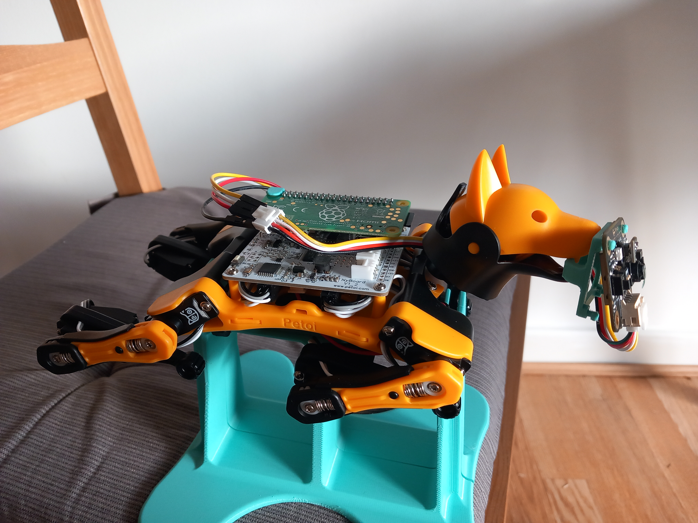
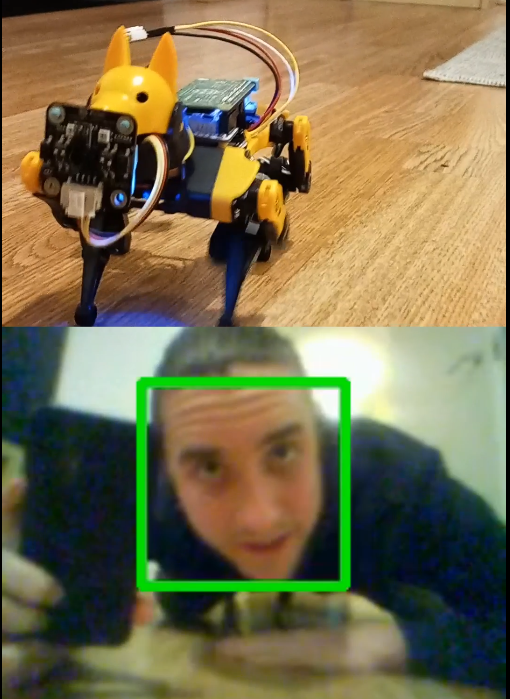
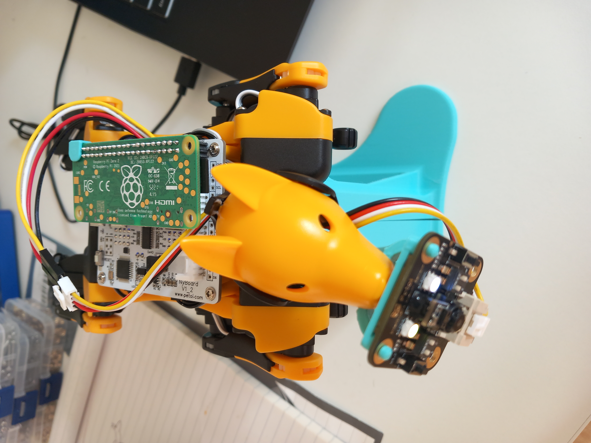
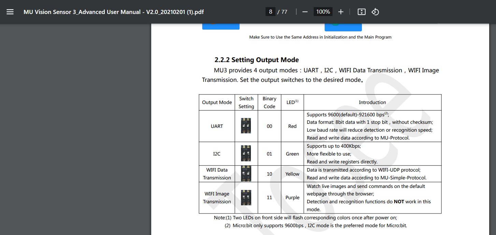
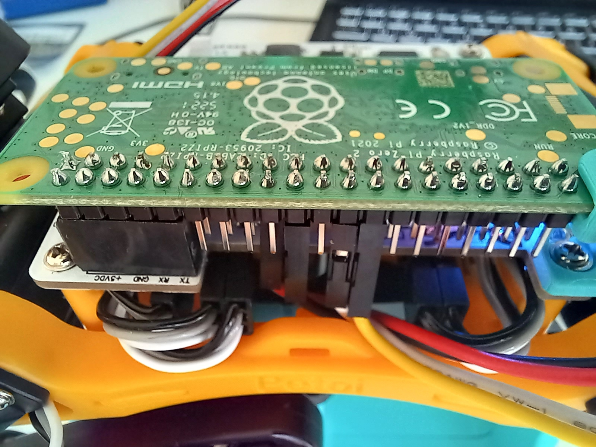

# bittle_demo

Sometimes working with software can feel like talking to the dead. I had bought a Bittle robot from Petoi as well as a MU3 Vision Sensor and my first goal was to get images from the camera, do computer vision, and control the bittle based on the computer vision. I claim success, though with poor frame rate and detection [here](https://youtube.com/shorts/tQmUvWTJrBk).  




There came a point, when I was running a serial console and typing in commands to setup the camera's wifi, where I thought of the engineers that wrote the software on the other side of the console, on the camera. These engineers had thoughtfully created the interface I was using, probably years ago. They may be dead now, or have given up on a software career and are enjoying an engaging life in a budhist monastery. Sometimes working with other people's code can feel like talking to the dead--piercing the vale to commune with the spirits and tease out insights to to get the project running...

My hope is that the steps below and software libraries I published guide you on how to setup your own robotics platform using the Bittle and various camera sensors to do your own project. Note that the MU3 Vision Sensor does much better do computer vision algorithms than I implemented and runs faster. That said, I couldn't find the source code for the firmware, so extending its firmware wasn't an option for me.

1. [Replicating](#Replicating)
    1. [Pi Setup](#PiSetup)
    2. [Hardware Setup](#HardwareSetup)
    3. [Camera & Wlan](#Camera&Wlan)
    4. [Demo](#Demo)  

## Replicating

My hardware setup looked like this and included a Raspberry Pi Zero 2 W, Male to Female 2.54 dupont cables, a MU3 Vision sensor, some 3d printed parts, and a Bittle wtih a NyBoard V1_2.  




### PiSetup

I used a raspberry pi zero 2 w. I thought the small size and weight of this would be helpful for the Bittle's walking. The CPU with 4 cores running at 1GHz is punchy.  

I used Ubuntu 22.04 as the operating system. I used the raspberry pi imager tool to flash an SD card and input wlan details and enable ssh. I first booted without a connection to the NyBoard to disable the serial console and such as per below.  

On Raspberry Pi OS the the relevant files are in a different folder, /boot i believe.
1. Ensure that the line `enable_uart=1` is uncommented in the /boot/firmware/config.txt file, it should be by default.
2. remove any reference to console in /boot/firmware/cmdline.txt, ie remove `console=serial0,115200`.
3. disable the serial console `sudo systemctl stop serial-getty@ttyS0.service && sudo systemctl disable serial-getty@ttyS0.service`

From here I considered briefly how the raspberry pi is a non-real time operating system and doing things using software with the GPIO pins can be difficult as the OS taketh and giveth resources. Then I installed a software serial port to talk to the camera to setup wlan.  


```
git clone https://github.com/adrianomarto/soft_uart
cd soft_uart
make
sudo apt-get update && sudo apt-get install checkinstall
sudo checkinstall # a menu will come up, follow instructions and accept defaults
```  

Install some code we will use later
```
pip install my-bittle my-mu3
```

### HardwareSetup

I had to decide how to talk to the camera, and how to talk to the bittle robot.


The documentation for the camera lists 4 modes:  
  

Of these, the only one I could use was the WIFI Image Transmission mode, given I wanted the raw images to do my own detection with. I'll note again how this is a little silly as the point of the MU3 is to do the detection itself and send the output via a variety of interfaces and it does this quite well. That said I am a silly man.  

The MU3 will broadcast a wifi network by default in this mode. I had to decide whether to use this network and connect everythign to it (raspberry pi, support computer) or whether to use my own home wifi network. I decided to use my own home wifi network, but this meant I had to send the details to the MU3 via AT commands. I documented the AT commands in this repo [here](https://github.com/MZandtheRaspberryPi/my_mu3). I then decided to use a software serial port on the raspberry pi, so I could have the pi always plugged into Bittle while still configuring the camera.


The below steps mostly use internal labels (from 1 to 40) to refer to pin numbers, NOT Broadcom (BCM) Naming (such as GPIO2). 
1. Flip the two switches labelled output on the left of the MU3 camera to up to set the MU3 to image transmission mode.  
2. Plug the MU3 power into the pi zero 3.3 volt power, pin 17. Plug the MU3 ground into the pi ground pin 20. Plug the MU3 RX pin (white cable often) into the pi pin 24 (GPIO 8 in BCM convention). Plug the MU3 TX pin (yellow cable often) into the pi pin 26 (GPIO7). 
3. Plug the pi zero 2 w into the Bittle via the NyBoard.



### Camera&Wlan
You will have to do this each time the camera is powered on. It will not save after a camera reset.  
1. ssh into the pi (I use MobaXterm).  
2. bring up the software serial port to talk to the camera `sudo insmod ~/soft_uart/soft_uart.ko gpio_tx=8 gpio_rx=7`
3. connect the MU3 to your wlan, inputting your wlan (wifi) details into the command. Note no spaces in the ssid name or in the password.  `setup-wlan my_ssid my_password /dev/ttySOFT0`. You should see the front lights on the MU3 turn off and the back light turn on indicating it is connected. You should also see an IP Address printed in the terminal that the camera received. On a computer connected to the same network, you should be able to type this ip address into your url bar and see a camera interface, including an image stream. You could also use developer tools in chrome to see the address and port of the stream.    
4. Unload the kernel module for the software serial port `sudo rmmod soft_uart.ko`

### Demo
The first time you run this script it may be helpful to have the Bittle on a test stand where its legs can't touch the ground to prevent hurting it in case of bugs/errors. A stack of books can work nicely for this.  

```
git clone https://github.com/MZandtheRaspberryPi/bittle_demo.git  
cd bittle_demo
# input your mu3 ip address into the global variable 'IP_ADDRESS' in come_to_me.py
python3 come_to_me.py
```

If you move your face in front of the camera, the Bittle should start to walk forward. Detection is not great, so you may need to move your face around and try different angles. To exit the script, hold 'q'.

It will print out the frame rate of the camera and of the face detection algorithm. It will also create a timestamped folder with images from the camera. You may wish to make a video of the output images, to do so you could use ffmpeg inputting the framerate that the script prints.   

```
ffmpeg -framerate 5.3 -i ./20240122-233344/frame_%d.png -c:v libx264 -pix_fmt yuv420p my_bittle.mp4
```


## Areas for Improvement
* The frame rate of the camera in Image Transmission mode, and the resolution are not amazing (240/180 pixels, 5fps? sometimes more). More advanced computer vision projects may suffer from this, but for hobby projects it may be ok. To be fair, this is a lot of data to transfer. 240 pixels times 180 pixels times 3 channels (RGB) results in 129,600 bytes of data per image. 10 images a second is 10,368,000 bits per second, or 10.3 Megabits.
* The software serial port used to setup the camera's wlan is a weakpoint in that it is not super reliable. Plugging into the NyBoard may be more reliable, but when I compiled the OpenCat repo I noticed we were close to the limit on program storage space.
* a better detection algorithm for faces is needed, perhaps one based on a CNN (there are implementations out there via opencv).
* there is another library that does communication with the bittle, alas i found it too late. It seems it does more work to discover serial ports than the library I wrote. Find it [here](https://pypi.org/project/pyBittle/).

## Closing Thoughts
I had fun integrating all of these components. In the future I would like to do more with computer vision and the Bittle and may try a different camera with a hard connection to the pi zero, perhaps via USB.

If you have the components in this project, you could consider extending it in various ways:
* can you get the Bittle to follow you when you go right and and left?
* can you implement more reliable face detection than the haarcascades method I used?
* can you improve frame rate of the MU3 sensor in image transmission mode or can you integrate a better camera sensor for working with raw images (like an Arducam?). Again the MU3 was designed to do detection itself and send outputs, and it does this very well.
